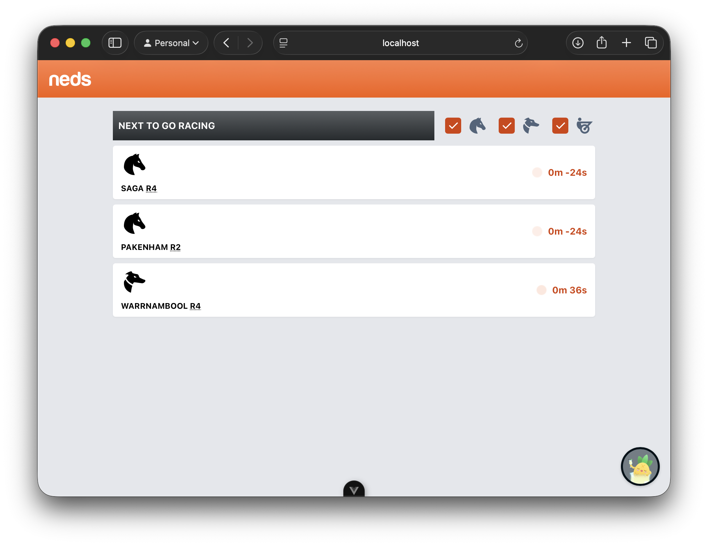
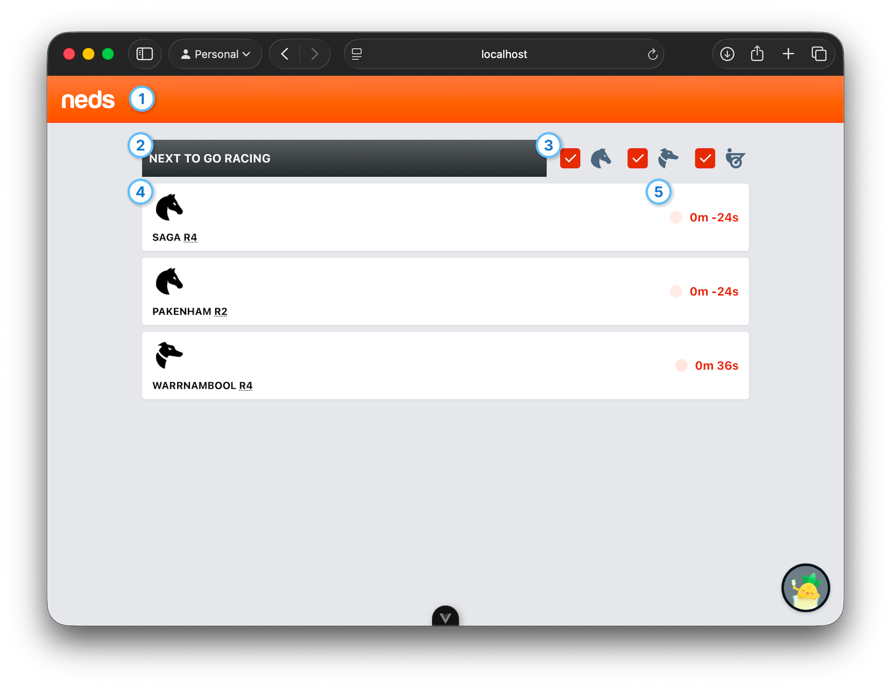
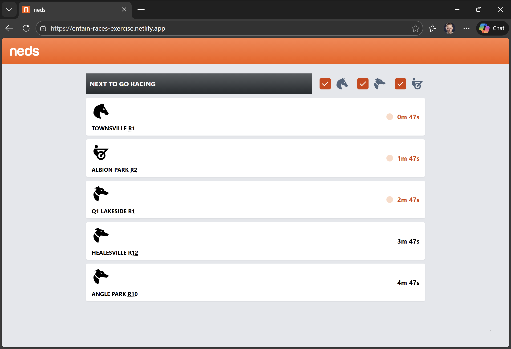
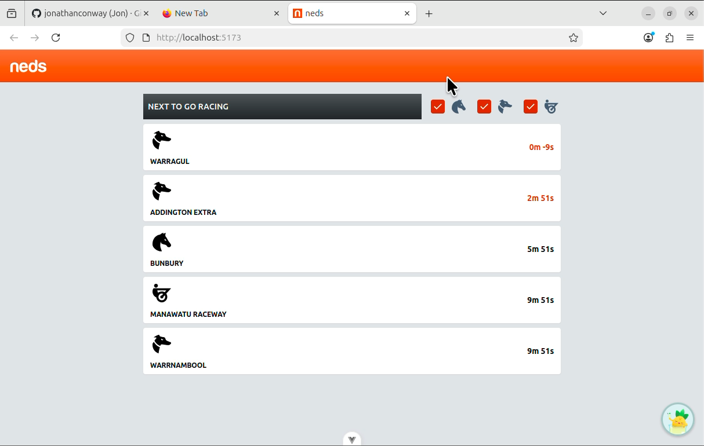
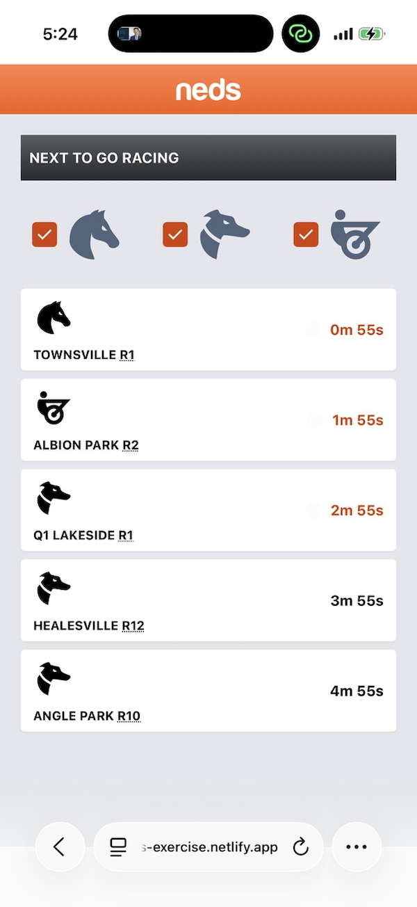
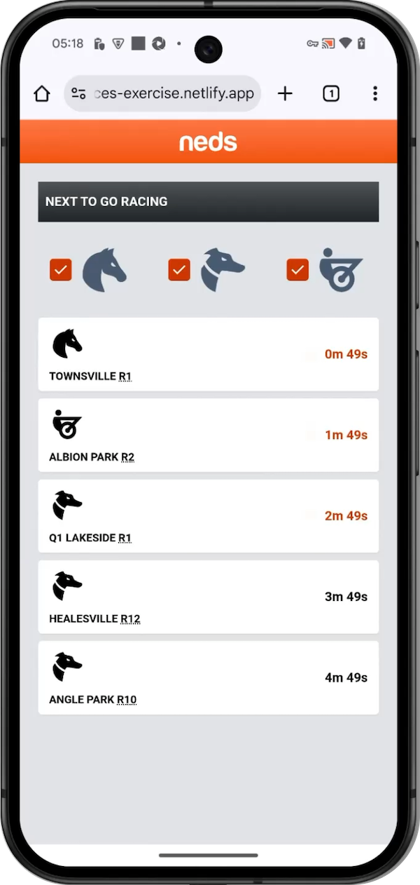
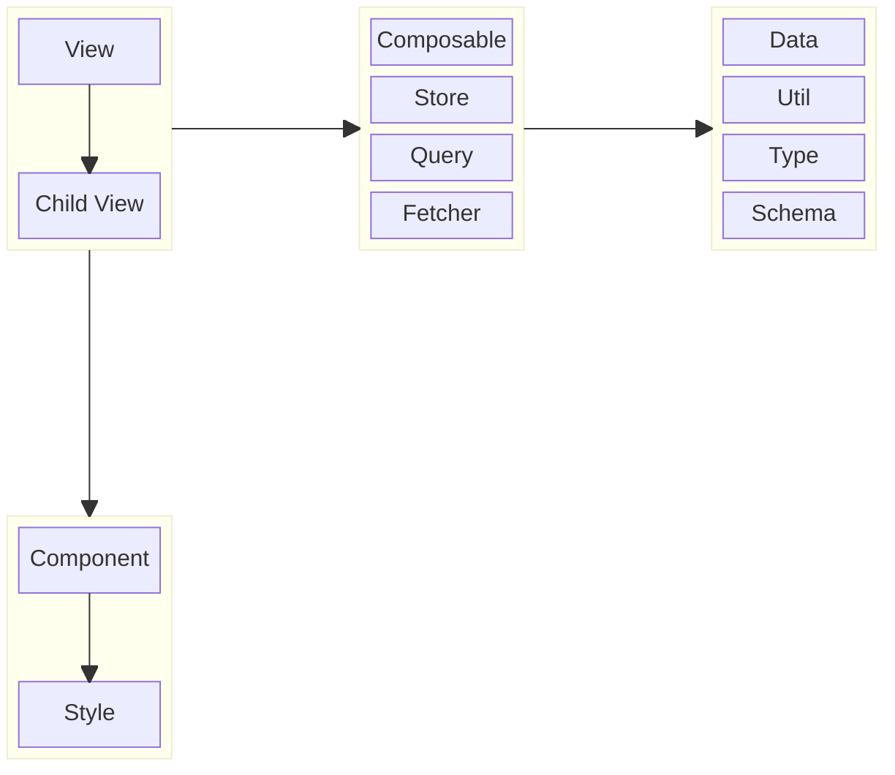
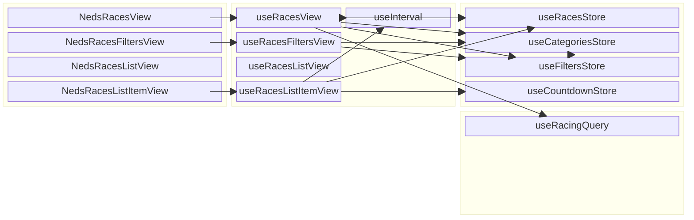
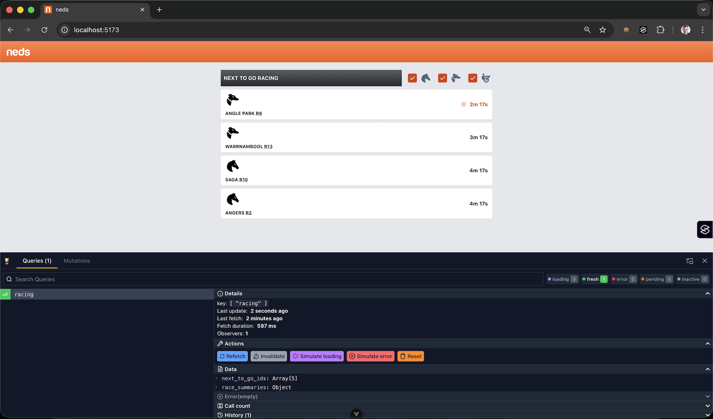

# Entain - Races exercise

[](http://commitizen.github.io/cz-cli/)

This exercise is a Single Page Application (SPA) that displays 'Next to go’ races from the [Neds Racing API](https://api.neds.com.au/affiliates/v1/#tag/Events/operation/List%20of%20Races).



Features include:

- Top 5 next races display
- Filter by category
- Live countdown and automatic refresh

The solution is:

- **Carefully designed** according to Neds branding (colours and icons)
- **Vue idiomatic** utilising Views, Components and Composables
- **Readable** with code implemented in a clean, modular manner
- **Maintainable** with comments, re-usable component design, structured documentation
- **Debuggable** with global Pinia store
- **Performant** with efficient data structures and calculation logic for countdowns and caching via Pinia Colada
- **AI ready** with customized Sub Agent Definitions, Commands and Skills
- **Documented** with setup instructions and guidelines
- **Accessible** with screen-reader and keyboard-only support, ARIA tags, high color contrast and documented accessibility testing processes
- **Compatible** across popular browsers, OS's and devices

You can access a hosted version of the application at [https://entain-races-exercise.netlify.app](https://entain-races-exercise.netlify.app). ¹

---

<small>¹ Note: Due to CORS limitations, the hosted version serves mocked data.</small>

---

- [Features](#features)
  - [Walkthrough](#walkthrough)
  - [Behaviours](#behaviours)
  - [Accessibility](#accessibility)
- [Technical](#technical)
  - [Setup](#setup)
  - [Stack](#stack)
  - [Structure](#structure)
  - [Implementation](#implementation)
  - [Guidelines](#guidelines)
  - [Debugging](#debugging)
  - [AI integration](#ai-integration)
  - [Decisions](#decisions)
  - [Improvements](#improvements)

## Features

### Walkthrough

Screenshot of application with sections numbered:



The application is composed of:

1. Header
2. Section: "Next To Go Races"
3. Filters
4. Races
5. Countdown

#### 1. Header

- Displays Neds logo

#### 2. Section: Next To Go Races

- Displays the next 5 races to go, at the current time

#### 3. Filters

- By category:
  - Options: Horse, Greyhound and Harness race
  - More than one can be selected
  - By default, all are selected

#### 4. Races

- Displays each race in its own card
- Displays category of the race as an icon
- Displays meeting name of the race underneath category
- Displays countdown to race start in minutes and seconds on the right-hand-side

#### 5. Countdown

- Displays seconds remaining until race start
- Displays seconds passed after race start up to 1 minute
- Displays "getting close" animated indicator when race is less than 3 minutes away

### Behaviours

The application has the following behaviours:

- Races countdowns are updated every 1 second
- Races that have 2 minutes or less to go are highlighted and animated
- Races that are 1 minute past the start time are removed
- Every 5 minutes the list is refreshed

---

Video walkthrough of application:

https://github.com/user-attachments/assets/e9b351e6-835d-4ded-b86e-fc80cd5ceaed

---

### Accessibility

The application supports basic AA accessibility as defined by WCAG including:

- **Perceivable**
  - Appropriate heading structure and semantic element usage
  - Ability to be perceived non-visually by a screen-reader
  - High contrast on all critical elements
- **Operable**
  - Ability to be operated without a mouse using keyboard or device
- **Understandable**
  - Simple English
- **Robust**
  - Cross-browser support: Chrome, Safari
  - Range of screen sizes and zoom levels supported
  - Layout and sizing of filter controls and width of list are responsive for Mobile, Tablet and Desktop

Walkthrough demonstrating keyboard, screen-reader (VoiceOver), screen sizes and zoom levels:

https://github.com/user-attachments/assets/ced619af-6c2e-4b19-b0f8-5877afae511f

Accessibility checker in Silktide:


### Compatibility

#### Desktop

<table>
<thead>
<tr>
<th>Edge on Windows</th>
<th>Firefox on Ubuntu</th>
</tr>
</thead>
<tbody>
<tr>
<td>

</td>
<td>

</td>
</tr>
</tbody>
</table>

#### Mobile

<table>
<thead>
<tr>
<th>Safari on iOS</th>
<th>Chrome on Android</th>
</tr>
</thead>
<tbody>
<tr>
<td>

</td>
<td>

</td>
</tr>
</tbody>
</table>

## Technical

### Setup

#### Recommended IDE Setup

- [VS Code](https://code.visualstudio.com/) + [Vue (Official)](https://marketplace.visualstudio.com/items?itemName=Vue.volar) (and disable Vetur)

#### Recommended Browser Setup

- Chromium-based browsers (Chrome, Edge, Brave, etc.):
  - [Vue.js devtools](https://chromewebstore.google.com/detail/vuejs-devtools/nhdogjmejiglipccpnnnanhbledajbpd)
  - [Turn on Custom Object Formatter in Chrome DevTools](http://bit.ly/object-formatters)
  - [Colada devtools](https://chromewebstore.google.com/detail/icdbaobbeemmhlmjolbkedcneadkfpdl?utm_source=item-share-cb)
  - [WAVE Evaluation Tool](https://chromewebstore.google.com/detail/wave-evaluation-tool/jbbplnpkjmmeebjpijfedlgcdilocofh?utm_source=ext_sidebar)
  - [Silktide Accessibility Checker](https://chromewebstore.google.com/detail/silktide-accessibility-ch/mpobacholfblmnpnfbiomjkecoojakah?utm_source=ext_sidebar)
- Firefox:
  - [Vue.js devtools](https://addons.mozilla.org/en-US/firefox/addon/vue-js-devtools/)
  - [Turn on Custom Object Formatter in Firefox DevTools](https://fxdx.dev/firefox-devtools-custom-object-formatters/)

#### Project Setup

Install:

```sh
pnpm install
```

Compile and Hot-Reload for Development:

```sh
pnpm dev
```

Type-Check, Compile and Minify for Production:

```sh
pnpm build
```

Run Unit Tests with [Vitest](https://vitest.dev/):

```sh
pnpm test:unit
```

Lint with [Oxlint](https://oxc.rs/):

```sh
pnpm lint
```

Format with [Prettier](https://prettier.io/):

```sh
pnpm format
```

### Stack

- Languages
  - [Typescript](http://typescriptlang.org)
  - [Javascript](https://ecma-international.org/publications-and-standards/standards/ecma-262/)
  - [HTML](https://html.spec.whatwg.org/)
  - [CSS](https://w3.org/TR/CSS/#css)
- Packages
  - [PNPM](https://pnpm.io)
- Runtime
  - [Vite](https://vite.dev)
- Framework
  - [VueJS](http://vuejs.org)
- Libraries
  - [Pinia](http://pinia.vuejs.org) - global store
  - [Pinia Colada](https://pinia-colada.esm.dev) - data fetching layer
  - [Luxon](https://moment.github.io/luxon/) - time handling and formatting
  - [TailwindCSS](http://tailwindcss.com) - styling library
- Testing
  - [Vitest](http://vitest.dev)
  - [Vue Test Utils](https://test-utils.vuejs.org/guide/)
  - [MockServiceWorker](http://mswjs.io) - HTTP mocking
  - [Oxlint](https://oxc.rs) - linting
  - [Prettier](https://prettier.io) - formatting

### Structure



- **Views** [`📁 views`](./src/views/)
  - Views render the elements shown on a particular screen
  - Views can access composables, stores and queries
  - Views can delegate parts of their rendering to **Child Views**
- **Components**, **Styles** [`📁 components`](./src/components/)
  - Components are re-usable pieces of user interface logic and/or styling
  - Components are responsible for the fine-grained elements of the user interface
  - Components do not access global state, but are driven by their props
  - Components can delegate parts of their rendering to other components
  - Components can be composed via slots
  - Components apply **Styles** to HTML elements
  - **Styles** are based on the Tailwind framework
- **Composables** [`📁 composables`](./src/composables/)
  - Composables are re-usable units of stateful logic
  - Views delegate complex logic to dedicated View Composables
  - View Composable call Composables, Stores, Queries and Utils as needed
- **Stores** [`📁 stores`](./src/stores)
  - Stores are re-usable "slices" of global state, with their associated operations
  - Stores allow certain data or state to be managed globally, which ensures consistency and is useful when debugging
  - Stores are based on the Pinia framework
- **Queries** [`📁 queries`](./src/queries/)
  - Queries are re-usable composables for data-fetching from JSON APIs
  - Queries are based on the Pinia Colada framework
  - Queries call fetcher functions to fetch data from JSON APIs
  - Fetchers are based on the standard browser `fetch` function
- **Data** [`📁 data`](./src/data/)
  - Data files hold static hard-coded data in flat JSON files
- **Utils** [`📁 utils`](./src/utils/)
  - Utils are small general-purpose pure functions re-used across the application
  - Utils can wrap third-party libraries (such as Luxon) to reduce coupling
- **Types**, **Schemas** [`📁 types`](./src/types/)
  - Types refers to types and interfaces re-used across the application
  - Schemas are used to validate API responses before casting to types
  - Schemas are built using the Zod library

### Implementation



- App view renders Races (`NedsRaces.vue`), which renders Filters (`NedsRacesFilters.vue`), List (`NedsRacesList.vue`) and ListItem (`NedsRacesListItem.vue`).
- Views (`views/races/*.vue`) delegate non-template logic to View Composables (`composables/use-*-view.ts`).
- View Composables fetch Races from Racing API (using Pinia Colada), process them (via Utils) and store them in Races store (Pinia).
- Races (first 5) are picked from Racing API response (`pickNextRaces` util), enriched with hard-coded categories by ID (`enrichNextRaces` util), sorted by countdown ascending (`sortNextRaces`) and filtered by categories and not past 1 minute countdown (`filterNextRaces`).
- Filter categories are stored in Filters store (`useFiltersStore`) and filtered races are stored in Races store (`useRacesStore`). (Using Pinia)
- Countdowns are calculated from current time minus timestamp generated from seconds in races data. (Using Luxon).
- Countdowns are updated for each race once per second and races past 1 minute ago are removed once per second. (`setInterval` call)
- For efficiency, we simply subtract 1 from the countdown (which is stored in seconds), rather than re-calculate the whole date-time.
- Countdowns are cleared on list item unmount to avoid excessive memory consumption if the app is left running for long periods of time.
- Races list is refreshed every 5 minutes. (`setInterval` call)

### Guidelines

This section contains guidelines such as naming and coding standards.

#### File and folder naming

- Vue components and views, and their associated tests, are named in `PascalCase`
- All other files are in `kebab-case`
- Files have the following extensions:
  - `.md` - Markdown files containing documentation
  - `.vue` - Vue components and views
  - `.ts` - Typescript files such as utils, stores, composables and more
  - `.spec.ts` - Test files
  - `.css` - Stylesheets
  - `.json` - Data files such as mocks and hard-coded data sets

#### Code naming

- Interfaces, types, components and enums are in `PascalCase`
- Constants, variables and functions are in `camelCase`

#### Git commit messages

This project follows conventional commits.

```
<type>(scope): <subject>

<body>

<footer>
```

Rules:

- ✅ **Required**: Type is be one of: `fix`, `docs`, `style`, `refactor`, `perf`, `test`, `build`, `ci`, `chore`, `revert`
- ✅ **Required**: Subject is lowercase
- ✅ **Required**: Body (if provided) is lowercase
- ✅ **Required**: No period at the end of the subject line
- ❌ **Forbidden** capitalize the subject or body
- ❌ **Forbidden** use past tense (for example: use "add" instead of "added")

#### VueJS

- This code-base generally adheres to the [VueJS Style Guide](https://vuejs.org/style-guide/rules-essential.html), especially parts A and B.
- Vue's [Composition API](https://vuejs.org/guide/extras/composition-api-faq) is used rather than its Options API

#### Views and Components

- `<script>`
  - Imports
  - Props definition
  - Store, query and composable calls
  - Destructuring
  - Ref and computed declarations
  - Function calls
  - Lifecycle hooks
  - Subscriptions
- `<template>`

#### Component styles

Styles are applied using Tailwind classes.

Classes are generally ordered:

1. Positioning
2. Layout
3. Background
4. Border
5. Foreground
6. Animation
7. Cursor

Defaults are set before overrides (hover, focus, etc).

Variables are used for branding.

##### Stores and composables

- Imports
- Interface declarations
- Store or composable declaration
  - Other store, query and composable calls
  - Destructuring
  - Ref and computed declarations
  - Private function declarations
  - Function calls
  - Lifecycle hooks
  - Subscriptions
  - Return statement

##### Utils

- Short and concise
- Parameters are named and destructured only inside the function, for clarity and ease of logging
- For >2 parameter values, they should be nested in a single parameter object, for clarity

#### Automated tests

This project contains many automated tests to verify correct behaviour and ease debugging.

##### Integration vs. unit

There are two kinds of automated tests in this project:

- Integration tests
- Unit tests

Integration tests:

- Are per-view
  - In this project, [NedsRaces.spec.ts](./src/views/races/__tests__/NedsRaces.spec.ts)
- Cover whole user interactions with the application at a high-level
- Are intended to verify correctness of the application as a whole
- Mock endpoints such as API responses and timers
- Mocks in integration-style tests use realistic data contained in json files
- HTTP endpoint is mocked using MockServiceWorker
- For simplicity, current date and time is mocked as only one value

See: [Static vs Unit vs Integration vs E2E Testing for Frontend Apps](https://kentcdodds.com/blog/static-vs-unit-vs-integration-vs-e2e-tests)

Unit tests:

- Are per-unit
  - Components
  - Composables
  - Stores
  - Utils
- Cover fine-grained behaviour
- Are intended ease refactoring, modification and debugging
- Mocks in unit tests are defined once per unit test, inside the unit test closure. Mocks contain the minimal structure and content necessary to test the behaviour covered by the unit test.

##### General

- Tests for any given `{structure}` are located in a `__tests__` sub-folder and named after the structure. For example: `{structure}.spec.ts`.
- Tests for any given `{structure}` are wrapped in a `describe` block named after that structure
- Test names are all lower case and spaced. For example: `"renders correctly"`.
- Tests cover all and only the behaviour that is actually used in the application
- Tests avoid covering third-party framework behaviour
- Tests cover only one representative sample of behaviour. For example, a typical numeric value, not every possible number.
- Tests are organised in arrange / act / assert blocks
- DOM elements are held in constants named with a suffix of `El`
- Tests focus on behaviour / logic, not on repeating value statically declared in the code
- Expect calls in unit tests use literal values (not re-usable mocks or other external data). This is to simplify diagnosis of failing tests by revealing explicitly the difference between the expected and actual values
- Tests are deliberately written in a verbose style, with minimal use of re-usable functions. This is to ease debugging and rapid pinpointing of failures where they occur, without having to navigate nested function calls.
- Longer unit tests are organised with grouping comments

#### Documentation

Self-documenting code is preferred with inline comments used minimally where important information is be expressed in code.

Non-trivial functions and other structures have explanatory JSDoc comments.

JSDoc comments should be formatted as follows:

> ```
> /**
>  * @name (only if not provided by code)
>  *
>  * {brief multi-line description}
>  *
>  * @example (optional)
>  * @type (if not provided by code)
>  */
> ```

### Debugging

#### Inspecting state

State can be inspected using appropriate tools for each level.

##### Component state

[Vue.js devtools](https://chromewebstore.google.com/detail/vuejs-devtools/nhdogjmejiglipccpnnnanhbledajbpd)


##### Store state

[Pinia tab in Vue.js devtools](https://chromewebstore.google.com/detail/vuejs-devtools/nhdogjmejiglipccpnnnanhbledajbpd)


##### Query state

[Colada devtools](https://chromewebstore.google.com/detail/icdbaobbeemmhlmjolbkedcneadkfpdl?utm_source=item-share-cb)



### AI integration

AI integration is facilitated by context files and documentation, providing specific, structured inputs that enable AI assistants to provide useful outputs.

Documentation file:

- 📄 `README.md`
- 📁 `*`
  - 📄 `README.md`

- 📄 `README.md` files are human-readable documentation, applicable to the folder, files and subfolders in which they reside. AI assistants can read these files to enrich their context, helping them to perform tasks.

AI context files:

- 📄 `AGENTS.md`
- 📁 `.ai`
  - 📄 `documentation-updates.md`
  - 📁 `agents`
    - 📄 `{agent}-agent.md`
  - 📁 `commands`
    - 📄 `{command}-command.md`
  - 📁 `skills`
    - 📄 `{skill}-skill.md`

- 📄 `AGENTS.md` serves as an entry-point for agents, providing context and instructions to help it perform tasks, pointing it to resources such as `README.md` files.
- 📄 `documentation-updates.md` is maintained by AI assistants and stores learnings from past sessions. This stored knowledge enables AI assistants to learn and improve over time.
- 📁 `agents` contains agent definitions. These guide an AI assistant to perform more general and potentially longer-running tasks, while taking on the persona of a specialist, such as a coder or code reviewer.
- 📁 `commands` contains command definitions. Commands are used to direct an AI assistant to immediately perform a specific and well-defined task. They are typically signalled with a `/` (slash) prefix.
- 📁 `skills` contains skills. Skills package a description with resources such as scripts, images or documents, which augment an AI assistant with capabilities it might need to perform certain tasks.

### Decisions

This section captures and explains design and technical decisions made. I have strong opinions, weakly held and am open to feedback on any of these.

#### Simplifying assumptions

A simplifying assumption is an assumption made in order to move forward and reduce complexity, but which can be revisited if further information reveals it to be untrue.

- We can load races and categories once only on startup then auto refresh every 5 minutes, assuming that nothing important from the API will change meantime.
- We allow multiple category filters, as this seems very useful with minimal development overhead.
- Users are running on a modern browser
- API is robust, highly available and scalable to potentially millions of customers.
- API response JSON advertised start is seconds since the epoch (1 January 1970 00:00:00 UTC)

#### Folder structure

- Went with Vue-idiomatic: "views", "components", "stores" etc. This prioritises readability for developers already familiar with Vue.
- Alternately, could have used a more vertically-sliced folder structure: "races", "categories", etc. But this would require explanation and agreement from the team.

#### Data flow

- Stores are global, shared among views but limited to views only.
- Stores are "sliced" by topic: Categories, Races, Filters, Countdown. This is to reduce cognitive load and allow performance optimisation.
- Pinia selected for global store, as it is established and widely used.
- Pinia Colada selected for query manager, as it is established integrates smoothly with Pinia.
- Views encapsulate context specific to areas of the application, passing minimal amount of data required to components via props
- Views are decomposed into child views, for readability - smaller more focussed files
- Could have isolated child views further via props and emitters (“dumb components”) but it’s extra code and seems unnecessary in this small scale app and without knowing how they will be reused. The categories filter, for example, seems specific to this view.

#### Styling

- Chose Tailwind as it was listed as "bonus" in the Technical Task description
- Personally would have preferred to use custom CSS with a strongly-typed framework such as [Vanilla Extract](https://vanilla-extract.style)
- Opted for plain inline Tailwind classes. This was for simplicity, readability by majority of Tailwind developers and robust implementation. Avoided non-idiomatic approaches like `@apply` or binding to a string array, which carry certain risks and limited support.
- Tried to minimise classes by keeping design simple and modularising components

#### Security

- Client API inputs and outputs are strongly typed and checked at runtime using Zod.
- Due to the limited feature set, security risks seem minimal
- Pen testing and further hardening might be necessary for large-scale production deployment
- Build might need to be hardened further for use in a production CI/CD setup

#### Performance

- Updating countdowns and removing past races on each timer tick should be Ok with 5 races.

#### Routing

- Avoided adding routing for simplicity and given the one-page scope. Would add routing if multiple pages / screens needed to be added.

### Improvements

This section lists ideas for improvement.

The solution is probably production-ready with its current small feature set and limited audience. But ideally it would go through a round of code-review and maybe some limited pen testing.

Further work would be needed for long-term use and scaling to millions of customers.

#### Features

- [ ] Paging, infinite scroll or separate "history" section to view past races
- [ ] Prediction markets capability, trading race outcome predictions
- [ ] Live visualisations, such as a diagram of the race track and where the horses are positioned
- [ ] Chat with other betters and live support
- [ ] Shareable URLs with filters pre-set
- [ ] Larger Favicons for mobile and desktop shortcut
- [ ] Additional filter fields - such as location

#### Design and Usability

- [ ] Explore alternatives to loading skeleton, as [discussed in this talk](https://youtu.be/3ZyW4uYJVes).
- [ ] More interesting animations and visual designs to entertain and delight customers.
- [ ] More informative error messages, such as contact details and estimated time to recovery

#### Accessibility

- [ ] Improve accessibility of countdown and loading state if possible using ARIA attributes, live region
- [ ] Dark mode and high contrast mode
- [ ] Ability to turn off countdown for people sensitive to frequent interface updates

#### Readability

- [ ] [Wrap third-party code](https://www.youtube.com/watch?v=nhKCRYJQO_4&t=808s) to reduce coupling. For example, wrap Luxon in a local `date-time` module and Pinia in a local `store` module
- [ ] Third-party extension for auto-refresh, such as [colada-plugin-auto-refetch](https://www.npmjs.com/package/@pinia/colada-plugin-auto-refetch). But, as with any third-party addition, would increase security vetting effort and might not be worth it
- [ ] Extract `<script>` logic in views (NedsRaces.vue, NedsRacesFilters.vue, NedsRacesList.vue) to composables, to simplify view files
- [ ] Automated technical documentation using a tool such as [VuePress](https://vuepress.vuejs.org)

#### Maintainability

- [ ] Browser native objects for date-time formatting, such as [Intl.RelativeTimeFormat](https://developer.mozilla.org/en-US/docs/Web/JavaScript/Reference/Global_Objects/Intl/RelativeTimeFormat) and [Intl.DateTimeFormat](https://developer.mozilla.org/en-US/docs/Web/JavaScript/Reference/Global_Objects/Intl/DateTimeFormat), to eliminate Luxon dependency
- [ ] Configurability of past race threshold (default 1 minute), countdown refresh interval, etc. via environment variables
- [ ] Release notes (based on Conventional Commits) generated with a tool such as [jscutlery/semver](https://github.com/jscutlery/semver)
- [ ] Code generation using a tool such as [nx Generators](https://nx.dev/docs/reference/nx/generators)

#### Security

- [ ] Harden security for long-term production use, according to current [OWASP top-10](https://owasp.org/www-project-top-ten/) best practices

#### Reliability

- [ ] End-to-end tests using [Playwright](http://playwright.dev) or similar
- [ ] Visual diff tests and Storybook for live editing components

#### Performance

- [ ] Countdown logic could be cached / memoized
- [ ] Countdown decrement could be optimised by storing countdown as single number of seconds and subtracting 1 on each tick
- [ ] Server-Side Rendering (SSR) for faster upfront page loading

#### Scalability

- [ ] If we expanded it to many more races, I would consider more scalable approaches to list updates, refreshing and filtering. For example, indexed lookup maps, caching and list virtualisation for better performance and responsiveness

#### Capability

- [ ] Add Vue Routing for multi-screen / multi-page capabilities
- [ ] Better AI code assistant integration. CLAUDE.md file and similar
- [ ] Continuous Integration (CI) and Continuous Delivery (CD), using GitHub workflows or similar, to scale development team

#### Testing

- [ ] Some features still need tests written
  - [ ] Clear countdown on list item unmount

#### AI integration

- [ ] Add more context files
- [ ] Test with multiple assistants such as Claude, Codex. Improve as needed
- [ ] Implement Agent workflows, such as automated analysis, feature build, code review and pull request
